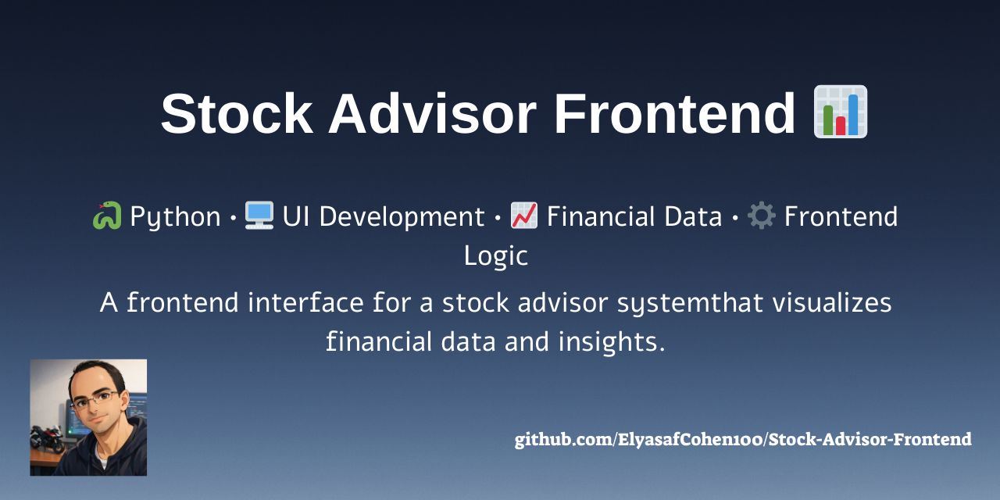
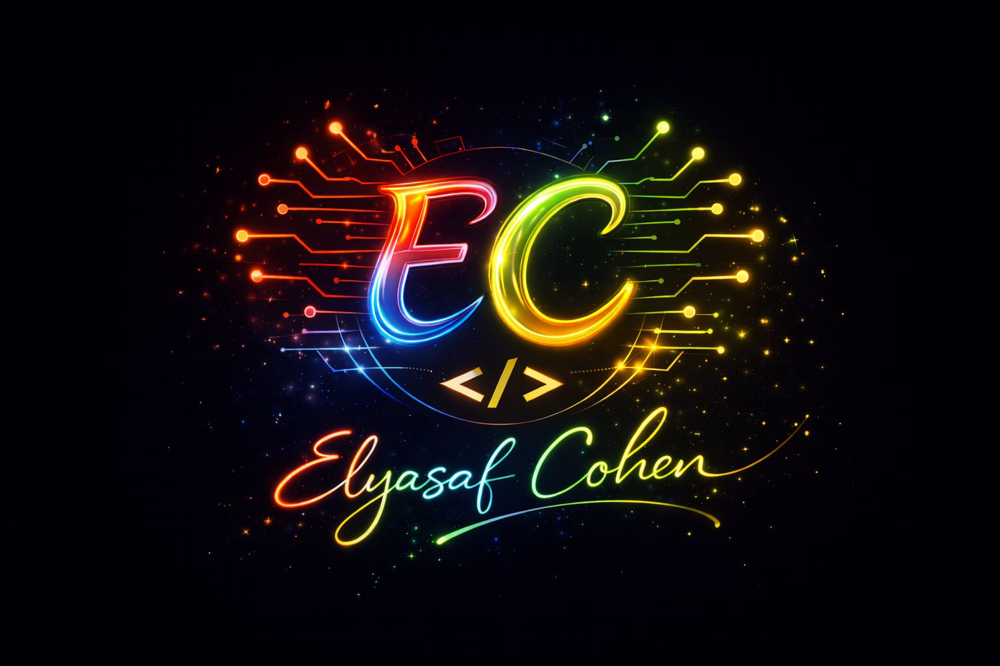

<p align="center">
  
</p>

<p align="center">
  
</p>

# 📈 Stock Advisor System 📈


> 🧠 **Desktop application for managing investments and exploring stock data**
> Built with **Python and PySide6**, featuring portfolio management, trading simulation, and an AI chatbot assistant.

---

# 🚀 Features

✨ Login system
📈 Buy stocks
📉 Sell stocks
📊 View order history
📂 Portfolio management
🤖 AI chatbot assistant for financial questions

---

# 🖥 Application Screenshots

## 🔐 Login Screen

<p align="center">
  
</p>

---

## 🏠 Main Dashboard

<p align="center">
  
</p>

---

## 💰 Buy Stocks

<p align="center">
  
</p>

---

## 📉 Sell Stocks

<p align="center">
  
</p>

---

## 📂 Portfolio

<p align="center">
  
</p>

---

## 🤖 AI Chatbot

<p align="center">
  
</p>

---

# 🏗 Project Structure 🏗

```
Stock-Advisor-Frontend
│
├── Fronted
│   ├── Services
│   │   ├── data_processing.py
│   │   ├── embedder.py
│   │   ├── generate_embeddings.py
│   │   ├── Ollama_api.py
│   │   └── vector_store.py
│   │
│   └── Windows
│       ├── LoginWindow.py
│       ├── MainWindow.py
│       ├── BuyStocksWindow.py
│       ├── SellStocksWindow.py
│       ├── PortfolioWindow.py
│       ├── OrderHistoryWindow.py
│       └── AIChatBotWindow.py
│
├── Pictures
└── README.md
```

---

# ⚙️ Installation ⚙️

Clone the repository:

```bash
git clone https://github.com/YOUR_USERNAME/Stock-Advisor-Frontend.git
```

Enter the project folder:

```bash
cd Stock-Advisor-Frontend
```

Create a virtual environment:

```bash
python -m venv venv
```

Activate it:

Windows:

```bash
venv\Scripts\activate
```

Install dependencies:

```bash
pip install PySide6
```

Run the application:

```bash
python Fronted/Windows/LoginWindow.py
```

---

# 💥 Technologies 💥

* Python
* PySide6 (Qt GUI)
* AI Chatbot Integration
* Vector embeddings
* Modular GUI architecture

---

## Create with good vibes by: 🎉

<p align="center">
  
</p>
                             
<p align="center">                    
  <a href="https://github.com/ElyasafCohen100">
     
  </a>
</p>

---

> ✨ If you like this project – please leave a star! ✨ 
